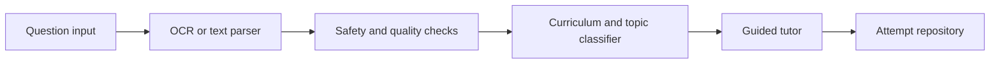

# SolvePath Australia — application framework

## Product scope

The current build is an English-language homework support web app for
Prep–Year 12 students. It is not VCE-specific. The working prototype covers the
complete learning loop:

1. add a typed question or choose a local image;
2. classify the question into a subject, year level and topic;
3. reveal hints progressively;
4. check the student's answer;
5. record the attempt and add incorrect work to the mistake book;
6. reuse saved attempts in practice and progress reporting.

## Current routes

| Route | Responsibility |
| --- | --- |
| `/` | Student dashboard and entry points |
| `/solve` | Question input, prototype analysis and guided help |
| `/practice` | Multi-question practice session |
| `/mistakes` | Review queue and mastery state |
| `/progress` | Attempt-based learning report |

## Domain layer

`lib/types.ts` is the canonical domain model for student profiles, questions,
attempts and mistakes. `lib/learning-state.ts` provides versioned seed state.

The app currently stores demo state in the browser through
`components/learning-provider.tsx`. This makes the prototype functional without
collecting identifiable student data or requiring accounts.

## Service boundary

`lib/tutor-engine.ts` defines the `TutorEngine` interface. The current
`demoTutorEngine` recognises two mathematics examples and otherwise maps the
input to a safe sample flow. A production implementation can replace this
adapter without changing the learning pages.

The intended production service sequence is:

## Planned production adapters

- OCR adapter for locally redacted homework images
- guided tutoring adapter with answer-checking and age-appropriate hints
- curriculum catalogue covering Australian year levels and learning areas
- authenticated student and parent profiles
- durable attempt, mistake and report repositories
- image storage with retention and deletion controls
- subscription and entitlement service

## Privacy defaults

- The current file picker does not upload or transmit images.
- Demo learning state remains on the current device.
- Production image processing should remove names, schools and student IDs
  before an external model receives the question.
- Parent reports should expose learning progress, not raw uploaded documents,
  unless the account holder explicitly chooses otherwise.

## Framework decisions

- Next.js-style App Router structure on the Sites Vinext runtime
- shared responsive application shell
- client-side learning context with schema-versioned state
- service interfaces kept separate from UI components
- progressive hints before explanations
- accessible labels, keyboard controls and live answer feedback
- no VCE-specific terminology or curriculum claims in the current build
